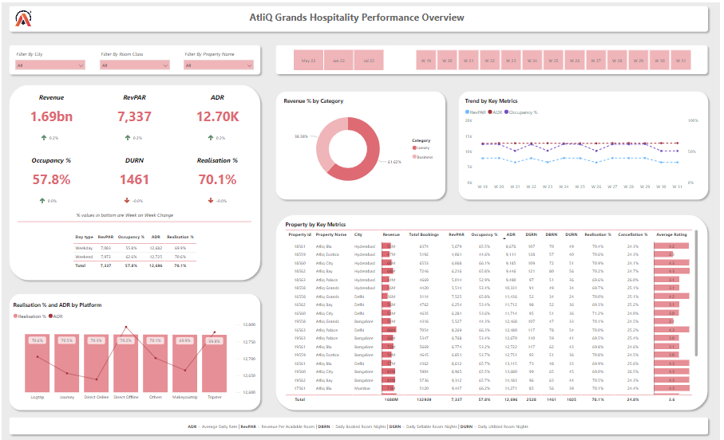

# AtliQ Grands Revenue & Performance Analysis (Power BI Project)

## 📌 Project Overview
This project analyzes the business performance of **AtliQ Grands**, a chain of five-star hotels in India, which has been facing declining market share and revenue due to increased competition and ineffective decision-making.

The goal of this project is to develop an **interactive Power BI dashboard** that provides actionable insights to support strategic decisions in the luxury/business hotel segment.

---

## 🎯 Objectives
- Analyze key factors impacting **revenue and occupancy performance**
- Identify trends affecting **market share decline**
- Provide **data-driven insights** to improve decision-making
- Highlight opportunities to enhance **operational efficiency and profitability**

---

## 📊 Key Metrics Analyzed
- **Revenue per Available Room (RevPAR)**
- **Average Daily Rate (ADR)**
- **Daily Sellable Room Nights (DSRN)**
- **Daily Booked Room Nights (DBRN)**
- **Daily Utilized Room Nights (DURN)**
- **Occupancy %**
- **Realization %**

---

## 🛠 Tools & Technologies
- **Power BI (Desktop & Service)**
- **Excel**
- **Power Query (Data Transformation)**
- **DAX (Data Modeling & Calculations)**

---

## 📈 Key Insights
- Identified declining trends in **occupancy and revenue performance** across key periods  
- Highlighted gaps between **booked vs utilized room nights**, indicating operational inefficiencies  
- Revealed opportunities to improve **pricing strategy (ADR)** and **room utilization**  
- Enabled comparison across **cities, properties, and time periods** for better decision-making  

---

## 📊 Dashboard Features
- Interactive filters (**city, property, time period**)  
- KPI cards for core hotel performance metrics  
- Trend analysis for revenue and occupancy  
- Drill-down capability for deeper insights  

---

## 📂 Dataset
This project is based on a dataset provided by **Codebasics** as part of a data analytics challenge.

---

## 🚀 Outcome
Built a comprehensive BI solution that transforms raw hospitality data into **actionable insights**, helping stakeholders monitor performance and identify areas for improvement.

---

## 📸 Dashboard Preview

